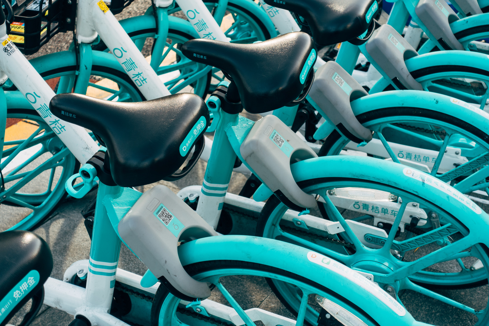
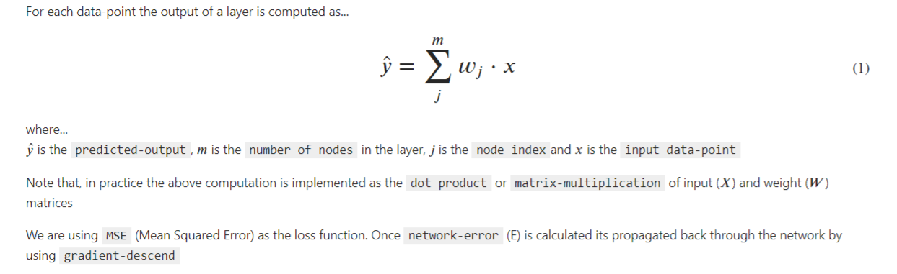
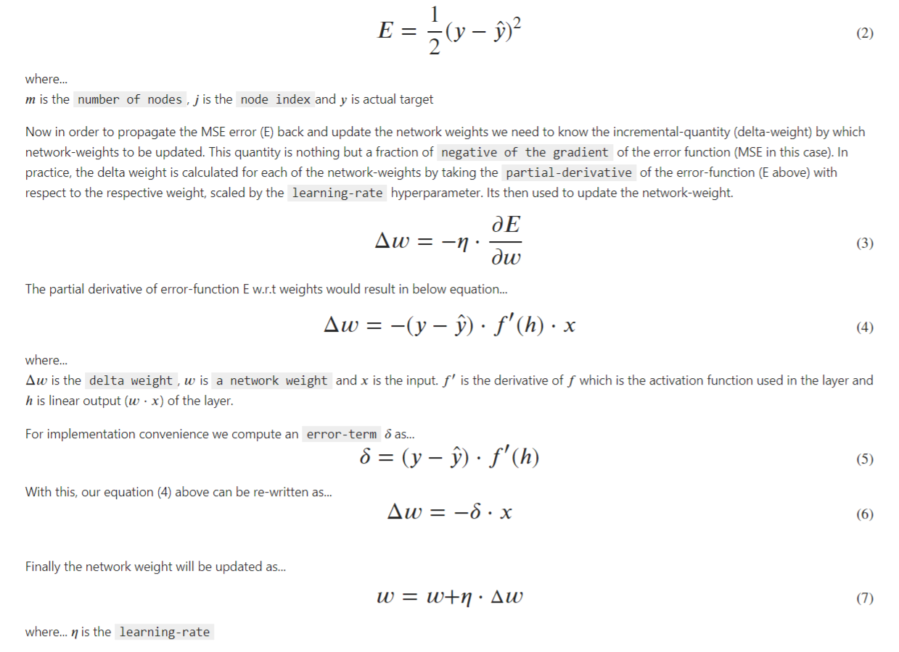
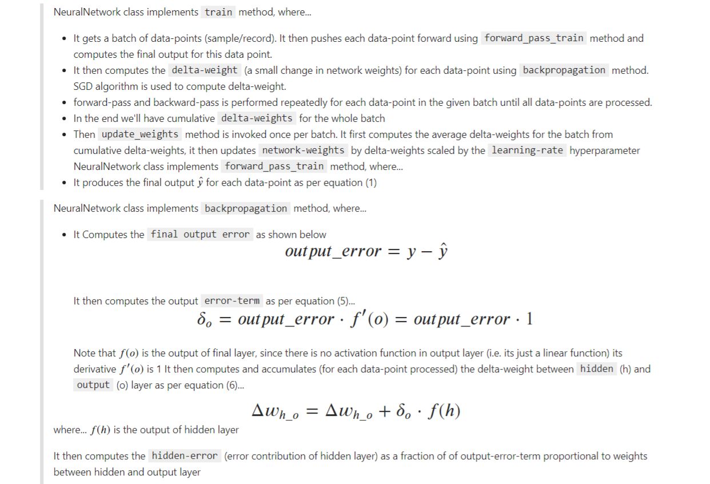
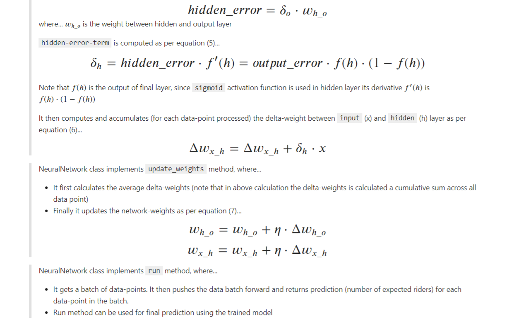

# BikeShare Riders Prediction

In this project we tackle a Regression problem. We will build a simple multi-layer-perceptron (MLP) or a Deep Neural Network (DNN) from scratch using the NumPy package to predict the number of riders BikeShare would get on a given day.



## Features
⚡Regression
⚡NN Implementation From Scratch
⚡Gradient Descent From Scratch
⚡NumPy


## Table of Contents

- [Introduction](#introduction) 
- [Objective](#objective)
- [Dataset](#dataset)
- [Solution Approach](#solution-approach)
- [Evaluation Criteria](#evaluation-criteria)
- [How To Use](#how-to-use)
- [License](#license)
- [Author Info](#author-info)


---
## Introduction
Imagine a bike-sharing company called BikeShare that rents bikes to riders. The company's revenue/profit is directly related to how many cycles it rents out on a given day. The company's significant dilemma is to forecast how many bikes it needs to make available in the shop on a given day. BikeShare will lose potential business and revenue if too many riders ask for bikes, but there aren't enough bikes available for rent. On the other hand, if riders are too few, the surplus bikes will be just sitting in the shop without being used and losing money. Based on the historical rental data, If BikeShare can forecast the number of potential riders looking to rent the bike on a given day, it can maximize its profits by efficiently managing the number of cycles it stocks daily.

---
## Objective
This project will build a simple multi-layer-perceptron (MLP) or a Neural Network (NN) model to predict the number of riders BikeShare would get on a given day. MLP/NN will be built from scratch using `NumPy.` We will not use sophisticated deep-learning frameworks such as PyTorch or Tensorflow to develop and train the network. The main aim here is to build the network from the ground up to get a deeper understanding of the inner workings of a typical neural network.

---
## Dataset
- Dataset used in this project is sourced from UCI Machine Learning Repository. Data is available daily (daily.csv) and hourly (hour.csv). 
For this project, we'll just make use of hourly data that is more granular than daily data. Dataset provides 2 years worth of data and its relatively small in size, a copy of `hour.csv` is available in the `data` folder in this repo. The complete dataset can be accessed from [here](https://archive.ics.uci.edu/ml/datasets/Bike+Sharing+Dataset)
- Hourly dataset features...
    - instant: record index
    - dteday : date
    - season : season (1:winter, 2:spring, 3:summer, 4:fall)
    - yr : year (0: 2011, 1:2012)
    - mnth : month ( 1 to 12)
    - hr : hour (0 to 23)
    - holiday : weather day is holiday or not
    - weekday : day of the week
    - workingday : if day is neither weekend nor holiday is 1, otherwise is 0.
    + weathersit :
    - 1: Clear, Few clouds, Partly cloudy, Partly cloudy
    - 2: Mist + Cloudy, Mist + Broken clouds, Mist + Few clouds, Mist
    - 3: Light Snow, Light Rain + Thunderstorm + Scattered clouds, Light Rain + Scattered clouds
    - 4: Heavy Rain + Ice Pallets + Thunderstorm + Mist, Snow + Fog
    - temp : Normalized temperature in Celsius. The values are derived via (t-t_min)/(t_max-t_min), t_min=-8, t_max=+39 (only in hourly scale)
    - atemp: Normalized feeling temperature in Celsius. The values are derived via (t-t_min)/(t_max-t_min), t_min=-16, t_max=+50 (only in hourly scale)
    - hum: Normalized humidity. The values are divided to 100 (max)
    - windspeed: Normalized wind speed. The values are divided to 67 (max)
    - casual: count of casual users
    - registered: count of registered users
    - cnt: count of total rental bikes including both casual and registered

Quote from the dataset readme.txt...
> <cite> Bike-sharing rental process is highly correlated to the environmental and seasonal settings. For instance, weather conditions, precipitation, day of the week, season, the hour of the day, etc., can affect the rental behaviors. The core data set is related to the two-year historical log corresponding to 2011 and 2012 from the Capital Bikeshare system, Washington D.C., the USA, which is 
publicly available in http://capitalbikeshare.com/system-data. We aggregated the data on two hourly and daily basis and then extracted and added the corresponding weather and seasonal information. Weather information is extracted from http://www.freemeteo.com. </cite>

---

## Solution Approach
- We start with Loading and then exploring the data by looking at available features and any apparent pattern/relationship between the features and target variable (`cnt`)
- One hot encoding is then applied to `categorical` features
- Test set is removed from the dataset and kept aside.
- `mean` and `standard-deviation` is calculated for each of the continuous features in the remaining data (training + validation).
- Both sets above are then standardized (scaled to std=1, mean=0) by using the statistics calculated above.
- The dataset is then split into training and validation sets (60 days worth of data)
- The Network is built as a python class `NeuralNetwork` with just one input, one hidden, and one output layer where the hidden layer uses a `sigmoid` activation
- The Network trains using the Stochastic Gradient Descend (SGD) method where a random batch of data points are pushed through the network and `network-weights` are updated once for this batch, then the next random batch is processed. The process is continued for a given number of epochs (iterations). Once done, we have a network with updated weights, i.e., a trained network that can be used by BikeShare for making the prediction. 

---

## Evaluation Criteria
* `MSE` is used as the primary metric for loss calculation and model evaluation, formula shown in equation (2) above
* Our goal is to obtain the lowest possible MSE for predictions made using the separately kept `test` dataset

---
## How To Use
1. Ensure the below-listed packages are installed
    - `NumPy`
    - `pandas`
    - `matplotlib`
2. Download `Predicting_bike_sharing_users.ipynb` jupyter notebook from this repo
3. Download the dataset (hour.csv) from the repo and place it in the `data` sub-folder 
4. Run the notebook from start to finish. To get even better predictions, you may want to experiment with the network `hyperparameters.` Note that the data provided is only for two years; the network seems to be making mistakes during holiday seasons. Possibly, use oversampling techniques to create synthetic data for holiday periods and re-train the network again to see if it can model the holiday season anomaly better. 
5. Predict using trained model...
    ```python
    preds = network.run(data_points)
    ```
---

## Appendix

### Loss function and Gradient Descend 




### Implementation details






## Credits
- Title photo by <a href="https://unsplash.com/@markuswinkler?utm_source=unsplash&utm_medium=referral&utm_content=creditCopyText">Markus Winkler</a> on <a href="https://unsplash.com/s/photos/bike-rental?utm_source=unsplash&utm_medium=referral&utm_content=creditCopyText">Unsplash</a>
---

## License

[](https://choosealicense.com/licenses/mit/)

Copyright (c) [2021] [Sunil S. Singh]

Permission is hereby granted, free of charge, to any person obtaining a copy
of this software and associated documentation files (the "Software") to deal
in the software without restriction, including without limitation the rights
to use, copy, modify, merge, publish, distribute, sublicense, and/or sell
copies of the software, and to permit persons to whom the software is
furnished to do so, subject to the following conditions:

The above copyright notice and this permission notice shall be included in all
copies or substantial portions of the software.

THE SOFTWARE IS PROVIDED "AS IS", WITHOUT WARRANTY OF ANY KIND, EXPRESS OR
IMPLIED, INCLUDING BUT NOT LIMITED TO THE WARRANTIES OF MERCHANTABILITY,
FITNESS FOR A PARTICULAR PURPOSE AND NON-INFRINGEMENT. IN NO EVENT SHALL THE
AUTHORS OR COPYRIGHT HOLDERS BE LIABLE FOR ANY CLAIM, DAMAGES, OR OTHER
LIABILITY, WHETHER IN AN ACTION OF CONTRACT, TORT OR OTHERWISE, ARISING FROM,
OUT OF OR IN CONNECTION WITH THE SOFTWARE OR THE USE OR OTHER DEALINGS IN THE
SOFTWARE.

---

## Author Info

- Twitter - [@_sssingh](https://twitter.com/_sssingh)
- Linkedin - [Sunil S. Singh](https://linkedin.com/in/sssingh)

[Back To The Top](#BikeShare-Riders-Prediction)

---
